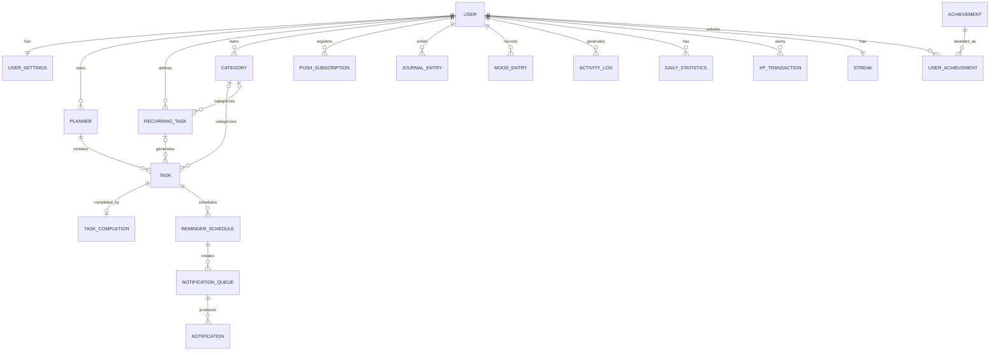

# Entity Relationship Diagram

## Daily Development Tracker

**Version:** 1.0  
**Status:** FROZEN  
**Document Type:** Entity Relationship Design  
**Database:** PostgreSQL  
**ORM:** Prisma

---

# 1. ERD Objective

This document defines the official Version 1 entity relationships for Daily Development Tracker.

The ERD describes:

- Entity ownership
- Parent-child relationships
- One-to-one relationships
- One-to-many relationships
- Optional relationships
- Junction relationships
- Authoritative event relationships
- Notification processing relationships

The frozen Database Design remains the source of truth for detailed field definitions, indexes, constraints, soft-delete behavior, and implementation notes.

---

# 2. Relationship Notation

The following notation is used:

```text
1     = Exactly one
0..1  = Zero or one
N     = Many
````

Examples:

```text
User 1 ─── 1 UserSettings
```

One User has exactly one UserSettings record.

```text
User 1 ─── N Planner
```

One User may own many Planner records.

```text
Task 1 ─── 0..1 TaskCompletion
```

One Task may have zero or one TaskCompletion record.

---

# 3. High-Level Entity Relationship Diagram

```text
User
│
├── 1 ─── 1 UserSettings
│
├── 1 ─── N Planner
│             │
│             └── 1 ─── N Task
│                           │
│                           ├── 1 ─── 0..1 TaskCompletion
│                           │
│                           └── 1 ─── N ReminderSchedule
│                                           │
│                                           └── 1 ─── N NotificationQueue
│                                                           │
│                                                           └── 1 ─── N Notification
│
├── 1 ─── N RecurringTask
│             │
│             └── 1 ─── N Task
│
├── 1 ─── N Category
│             │
│             ├── 1 ─── N Task
│             └── 1 ─── N RecurringTask
│
├── 1 ─── N PushSubscription
│
├── 1 ─── N JournalEntry
│
├── 1 ─── N MoodEntry
│
├── 1 ─── N ActivityLog
│
├── 1 ─── N DailyStatistics
│
├── 1 ─── N XPTransaction
│
├── 1 ─── 1 Streak
│
├── 1 ─── N UserAchievement
│             │
│             └── N ─── 1 Achievement
│
├── 1 ─── N Task
│
├── 1 ─── N TaskCompletion
│
├── 1 ─── N ReminderSchedule
│
├── 1 ─── N NotificationQueue
│
└── 1 ─── N Notification
```

The direct User relationships on operational records support ownership, authorization, and efficient user-scoped queries.

---

# 4. Mermaid ER Diagram



---

# 5. User Relationships

`User` is the primary ownership root for personal application data.

```text
User
│
├── UserSettings
├── Planner
├── RecurringTask
├── Category
├── PushSubscription
├── JournalEntry
├── MoodEntry
├── ActivityLog
├── DailyStatistics
├── XPTransaction
├── Streak
└── UserAchievement
```

Operational entities may also reference User directly.

These include:

```text
Task
TaskCompletion
ReminderSchedule
NotificationQueue
Notification
```

The direct ownership reference supports:

* Authorization
* User-scoped queries
* Background processing
* Notification delivery
* Data isolation

The service layer must preserve consistency between direct user ownership and parent entity ownership.

---

# 6. User and UserSettings

```text
User 1 ─── 1 UserSettings
```

Relationship type:

**One-to-One**

Rules:

* Every initialized user should have one settings record.
* A settings record belongs to exactly one user.
* `UserSettings.userId` must be unique.

UserSettings stores:

* Theme
* Language
* Notification preferences
* Reminder lead time
* Timezone
* Week-start preference
* Date format
* Time format

Timezone configuration is critical for scheduling.

---

# 7. User and Planner

```text
User 1 ─── N Planner
```

Relationship type:

**One-to-Many**

A user may have multiple planners across different dates.

Example:

```text
User
├── Planner — 2026-07-07
├── Planner — 2026-07-08
└── Planner — 2026-07-09
```

A user may have only one active planner for a specific local calendar date.

Conceptual uniqueness:

```text
userId + plannerDate
```

Soft deletion must be considered when implementing active-record uniqueness.

---

# 8. Planner and Task

```text
Planner 1 ─── N Task
```

Relationship type:

**One-to-Many**

A planner contains the user's activities for a specific date.

Example:

```text
Planner — July 8
│
├── Brush Teeth
├── Workout
├── Coding
└── Read Book
```

Every Task must belong to one Planner.

A Task must not exist without a daily planning context in Version 1.

---

# 9. User and Task

```text
User 1 ─── N Task
```

Relationship type:

**One-to-Many**

Task stores `userId` directly.

This relationship exists in addition to:

```text
Planner ─── Task
```

The direct User relationship supports:

* Ownership checks
* User-scoped task queries
* Scheduled task processing
* Background jobs

The Task user must match the Planner owner.

This consistency is enforced by backend business logic.

---

# 10. User and Category

```text
User 1 ─── N Category
```

Relationship type:

**One-to-Many**

Categories are user-owned.

Examples:

```text
Study
Fitness
Coding
Health
Reading
Personal
Work
```

One Category may categorize many Tasks and many RecurringTasks.

---

# 11. Category and Task

```text
Category 0..1 ─── N Task
```

From the Task perspective:

```text
Task N ─── 0..1 Category
```

Relationship type:

**Optional Many-to-One**

A Task may have one Category.

A Task may also exist without a Category.

Example:

```text
Task: Workout
Category: Fitness
```

or:

```text
Task: Call Mom
Category: None
```

---

# 12. User and RecurringTask

```text
User 1 ─── N RecurringTask
```

Relationship type:

**One-to-Many**

A RecurringTask is a reusable schedule definition.

Examples:

```text
Brush Teeth — Daily — 7:30 AM
Workout — Monday/Wednesday/Friday — 6:00 PM
Read — Daily — 8:00 PM
```

A RecurringTask does not represent daily completion.

It generates or contributes daily Task occurrences.

---

# 13. Category and RecurringTask

```text
Category 0..1 ─── N RecurringTask
```

From the RecurringTask perspective:

```text
RecurringTask N ─── 0..1 Category
```

A recurring definition may optionally belong to a Category.

Example:

```text
RecurringTask: Workout
Category: Fitness
```

---

# 14. RecurringTask and Task

```text
RecurringTask 1 ─── N Task
```

From the Task perspective:

```text
Task N ─── 0..1 RecurringTask
```

Relationship type:

**Optional Many-to-One**

A Task may be manually created.

Example:

```text
Task
recurringTaskId = null
```

Or generated from a recurring definition.

Example:

```text
RecurringTask: Brush Teeth
       │
       ├── Task — July 7
       ├── Task — July 8
       └── Task — July 9
```

Recurring task generation must be idempotent.

The system must prevent duplicate occurrences for the same recurrence event.

---

# 15. Task and TaskCompletion

```text
Task 1 ─── 0..1 TaskCompletion
```

Relationship type:

**Optional One-to-One**

A Task has:

* Zero completion records when incomplete.
* One completion record when completed.

`TaskCompletion` is the authoritative source of task completion.

The system must not use a second conflicting completion boolean as another source of truth.

Example:

```text
Task
│
└── TaskCompletion
      completedAt: 07:31
      completionMethod: NOTIFICATION
```

`TaskCompletion.taskId` must be unique.

---

# 16. User and TaskCompletion

```text
User 1 ─── N TaskCompletion
```

Relationship type:

**One-to-Many**

TaskCompletion stores user ownership directly.

This supports:

* Completion history
* Analytics
* Authorization
* Efficient user queries

The completion user must match the Task owner.

---

# 17. Task and ReminderSchedule

```text
Task 1 ─── N ReminderSchedule
```

Relationship type:

**One-to-Many**

A Task may have multiple reminder schedule records over its lifecycle.

Examples:

```text
Original Reminder
Snoozed Reminder
Replacement Reminder After Task Edit
```

Reminder schedules maintain scheduling history and processing state.

A future implementation may expose one primary active reminder to the user while retaining historical schedule records.

---

# 18. User and ReminderSchedule

```text
User 1 ─── N ReminderSchedule
```

Relationship type:

**One-to-Many**

ReminderSchedule stores direct user ownership.

This supports:

* Due reminder queries
* User notification settings
* Background processing
* Authorization

The reminder user must match the Task owner.

---

# 19. ReminderSchedule and NotificationQueue

```text
ReminderSchedule 1 ─── N NotificationQueue
```

Relationship type:

**One-to-Many**

A ReminderSchedule may create notification delivery work.

Example:

```text
ReminderSchedule
scheduledFor: 07:27
        │
        ▼
NotificationQueue
status: PENDING
availableAt: 07:27
```

Retries may remain associated with the queue processing model.

The implementation must prevent uncontrolled duplicate queue work.

---

# 20. User and NotificationQueue

```text
User 1 ─── N NotificationQueue
```

Relationship type:

**One-to-Many**

NotificationQueue stores direct user ownership.

This supports efficient processing and user-scoped operational investigation.

Queue records are infrastructure records.

They must not replace Notification delivery history.

---

# 21. NotificationQueue and Notification

```text
NotificationQueue 1 ─── N Notification
```

Relationship type:

**One-to-Many**

A queue item may produce notification delivery records.

Example:

```text
NotificationQueue
│
├── Notification Attempt / Delivery Record
└── Additional Delivery Record if architecture requires
```

Notification stores delivery history.

NotificationQueue stores processing work.

These entities have different responsibilities and must remain separate.

---

# 22. User and Notification

```text
User 1 ─── N Notification
```

Relationship type:

**One-to-Many**

Notifications are associated with the intended user.

This supports:

* Notification history
* Delivery investigation
* User-scoped queries

Notification records must not expose provider-sensitive data unnecessarily through normal APIs.

---

# 23. User and PushSubscription

```text
User 1 ─── N PushSubscription
```

Relationship type:

**One-to-Many**

A user may have multiple browser or device subscriptions.

Example:

```text
User
│
├── Chrome Laptop Subscription
├── Android PWA Subscription
└── Edge Desktop Subscription
```

Each push endpoint must be unique.

Invalid or expired subscriptions must be safely deactivated or removed according to the notification implementation policy.

---

# 24. User and JournalEntry

```text
User 1 ─── N JournalEntry
```

Relationship type:

**One-to-Many**

Version 1 supports one active primary journal entry per user per local calendar date.

Example:

```text
User
├── Journal — July 7
├── Journal — July 8
└── Journal — July 9
```

Historical journal entries remain available unless removed according to product policy.

---

# 25. User and MoodEntry

```text
User 1 ─── N MoodEntry
```

Relationship type:

**One-to-Many**

Version 1 supports one primary mood record per user per local calendar date.

Example:

```text
July 7 — HAPPY
July 8 — TIRED
July 9 — AMAZING
```

Mood data supports personal history and analytics.

---

# 26. User and ActivityLog

```text
User 1 ─── N ActivityLog
```

Relationship type:

**One-to-Many**

ActivityLog stores append-oriented domain history.

Example:

```text
TASK_COMPLETED
JOURNAL_CREATED
MOOD_LOGGED
XP_EARNED
ACHIEVEMENT_UNLOCKED
```

ActivityLog may reference another entity conceptually using:

```text
entityType
entityId
```

This is a domain reference.

It is not a universal relational foreign key.

Core business relationships must still use explicit relational entities.

---

# 27. User and DailyStatistics

```text
User 1 ─── N DailyStatistics
```

Relationship type:

**One-to-Many**

A user may have one DailyStatistics record per date.

Example:

```text
July 7
completion: 80%
notDone: 20%

July 8
completion: 100%
notDone: 0%
```

Conceptual uniqueness:

```text
userId + statisticsDate
```

DailyStatistics is derived data.

It does not replace Task and TaskCompletion as authoritative sources.

---

# 28. User and XPTransaction

```text
User 1 ─── N XPTransaction
```

Relationship type:

**One-to-Many**

XP uses an event transaction model.

Example:

```text
User
│
├── +10 XP — TASK_COMPLETED
├── +20 XP — JOURNAL_COMPLETED
└── +50 XP — STREAK_MILESTONE
```

The user's current XP may be derived from:

```text
SUM(XPTransaction.amount)
```

Each retryable XP event must use an idempotency strategy.

---

# 29. User and Streak

```text
User 1 ─── 1 Streak
```

Relationship type:

**One-to-One**

Each initialized user has one streak state.

The Streak entity stores:

* Current streak
* Longest streak
* Last qualifying date

`Streak.userId` must be unique.

The exact streak qualification rule must be frozen before streak implementation.

---

# 30. Achievement and UserAchievement

```text
Achievement 1 ─── N UserAchievement
```

Relationship type:

**One-to-Many**

Achievement is master data.

Example:

```text
FIRST_TASK
FIRST_PERFECT_DAY
STREAK_7
STREAK_30
```

A single Achievement may be unlocked by many users.

---

# 31. User and UserAchievement

```text
User 1 ─── N UserAchievement
```

Relationship type:

**One-to-Many**

Together:

```text
User N ─── N Achievement
```

The many-to-many relationship is implemented using:

```text
UserAchievement
```

Conceptually:

```text
User
      │
      ▼
UserAchievement
      │
      ▼
Achievement
```

Unique constraint:

```text
userId + achievementId
```

This prevents duplicate achievement unlocks.

---

# 32. Authoritative Data Relationships

The following relationships define important sources of truth.

## Task Completion

```text
Task
  │
  ▼
TaskCompletion
```

`TaskCompletion` is authoritative.

---

## XP

```text
User
  │
  ▼
XPTransaction
```

XP transaction history is authoritative.

---

## Achievement Ownership

```text
User
  │
  ▼
UserAchievement
  │
  ▼
Achievement
```

UserAchievement is authoritative for unlock ownership.

---

## Daily Task Planning

```text
User
  │
  ▼
Planner
  │
  ▼
Task
```

Planner and Task are authoritative for daily planned work.

---

## Notification Scheduling

```text
Task
  │
  ▼
ReminderSchedule
```

ReminderSchedule is authoritative for reminder schedule state.

---

## Notification Processing

```text
ReminderSchedule
        │
        ▼
NotificationQueue
```

NotificationQueue represents delivery work.

---

## Notification Delivery History

```text
NotificationQueue
        │
        ▼
Notification
```

Notification stores delivery history.

---

# 33. Full Core Domain Flow

The primary daily activity flow is:

```text
User
  │
  ▼
Planner
  │
  ▼
Task
  │
  ├─────────────────────┐
  │                     │
  ▼                     ▼
TaskCompletion      ReminderSchedule
  │                     │
  │                     ▼
  │              NotificationQueue
  │                     │
  │                     ▼
  │                Notification
  │
  ├──────────────► ActivityLog
  │
  ├──────────────► XPTransaction
  │
  ├──────────────► Streak
  │
  ├──────────────► UserAchievement
  │
  └──────────────► DailyStatistics
```

Some derived effects may be processed asynchronously.

All retryable domain effects must remain idempotent.

---

# 34. Recurring Activity Flow

```text
User
  │
  ▼
RecurringTask
  │
  ▼
Recurrence Evaluation
  │
  ▼
Task
  │
  ▼
Planner
```

The generated Task belongs to a daily Planner.

The Task may retain a reference to the RecurringTask that generated it.

Recurring generation must prevent duplicate occurrences.

---

# 35. Push Notification Flow

```text
User
  │
  ▼
PushSubscription

Task
  │
  ▼
ReminderSchedule
  │
  ▼
NotificationQueue
  │
  ▼
Background Processor
  │
  ▼
Push Subscription
  │
  ▼
Service Worker
  │
  ▼
User Notification
```

The delivery processor may create Notification history records.

Notification actions may securely call backend operations such as task completion or reminder snooze.

---

# 36. Relationship Integrity Rules

The following rules are mandatory:

1. Task user must match Planner user.
2. TaskCompletion user must match Task user.
3. ReminderSchedule user must match Task user.
4. NotificationQueue user must match ReminderSchedule user.
5. Notification user must match NotificationQueue user.
6. Category must belong to the same user as the Task or RecurringTask using it.
7. RecurringTask must belong to the same user as generated Tasks.
8. UserAchievement user and Achievement references must be valid.
9. Streak must belong to exactly one user.
10. UserSettings must belong to exactly one user.

Some cross-entity ownership rules cannot be expressed entirely through basic foreign keys.

The backend service layer must enforce them.

---

# 37. Deletion Relationship Rules

Deletion behavior must preserve important historical data.

Soft-deleted entities include defined major user-owned records.

Immutable or append-oriented event records should generally remain preserved.

Examples:

```text
TaskCompletion
XPTransaction
ActivityLog
```

Cascade deletion must not be enabled without considering historical integrity.

User account deletion requires a dedicated data lifecycle policy.

---

# 38. ERD Implementation Policy

The Prisma schema must implement the relationships defined in this document and the Database Design.

The implementation must not:

* Remove TaskCompletion and replace it with only `Task.completed`
* Remove XPTransaction and store only `User.xp`
* Remove UserAchievement and store achievement IDs in JSON
* Merge ReminderSchedule, NotificationQueue, and Notification into one table
* Store all daily planner tasks in a JSON column
* Replace explicit relationships with arbitrary metadata JSON

The relational model is intentional.

---

# 39. Milestone 01 ERD Scope

Foundation Milestone 01 does not implement the complete ERD.

Milestone 01 creates only:

* PostgreSQL connectivity
* Prisma foundation
* Migration infrastructure
* Seed infrastructure
* Database health verification

The full Version 1 relational model is implemented during an approved database/backend milestone.

This document remains the relationship source of truth when that implementation begins.

---

# 40. Final ERD Decision

The official Version 1 core relationship model is:

```text
User
│
├── UserSettings
│
├── Planner
│   └── Task
│       ├── TaskCompletion
│       └── ReminderSchedule
│           └── NotificationQueue
│               └── Notification
│
├── RecurringTask
│   └── Task
│
├── Category
│   ├── Task
│   └── RecurringTask
│
├── PushSubscription
├── JournalEntry
├── MoodEntry
├── ActivityLog
├── DailyStatistics
├── XPTransaction
├── Streak
└── UserAchievement
    └── Achievement
```

This relationship model prioritizes:

* Clear ownership
* Historical traceability
* Reliable notifications
* Idempotent completion
* Transaction-based XP
* Relational integrity
* Analytics compatibility

---

# DOCUMENT STATUS

**Version:** 1.0

**Status:** FROZEN

**Change Policy:** ERD changes require explicit database and architecture review.

This document is the source of truth for Daily Development Tracker Version 1 entity relationships.

````

